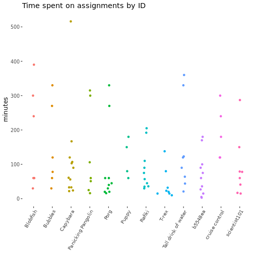
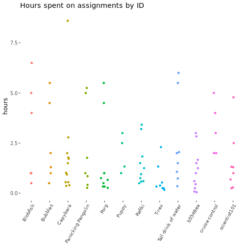
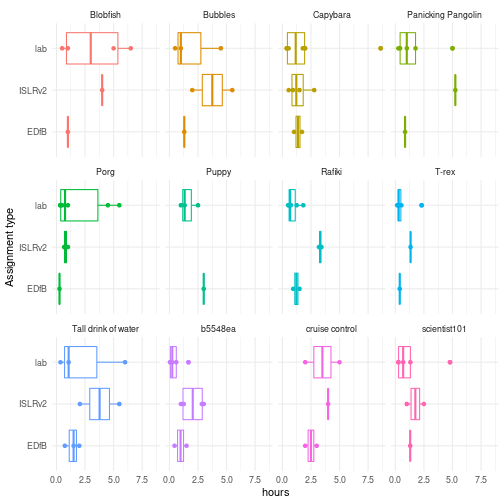
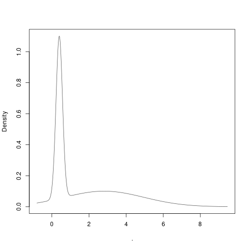
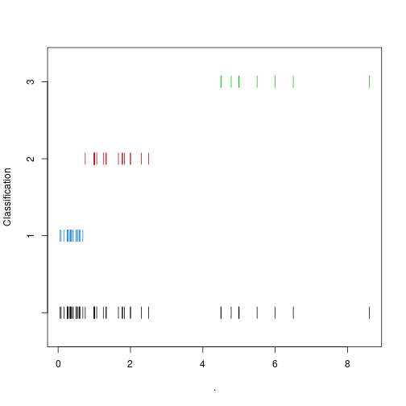
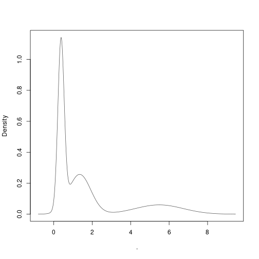

# Installation

Install the ExpDesign2021 package from github.


```r
#install.packages("remotes")
#install.packages("BiocManager")
#BiocManager::install("VanAndelInstitute/ExpDesign2021", build_vignettes=TRUE)
```

# Introduction

The recommended starting point for modeling things in the tidyverse is through
the [*tidymodels*](https://tidymodels.org/start/) package, and the tidymodels
folks suggest [*A ModernDive into R and the Tidyverse*](https://moderndive.com/) for beginners. So let's use [Chapter 5: Basic Regression](https://moderndive.com/5-regression.html) as a roadmap. We will also try and make this a bit easier.


# The assignments spreadsheet

To avoid some annoyance, I wrapped the usual read_sheet and gs4_deauth 
rigamarole in a function called `fetchAssignments` or, explicitly, 
ExpDesign2021::fetchAssignments. (If you want to be super clear about where 
a function should come from, package::function(arguments) is the way to go.)
Let's start by loading data from the first few weeks' assignments.


```r

# this package
library(ExpDesign2021)
library(knitr)

# grab some data to verify it works 
assignments <- fetchAssignments()
#> Calling gs4_deauth()...
#> Fetching data from https://docs.google.com/spreadsheets/d/1bJw_ad0PLQmLe4RvmRzsVnrOF-9Z9Xth9GTSdwO8B4M ...
#> ✔ Reading from "2021_ExpDesign".
#> ✔ Range 'Form Responses 1'.
#> Done.
# note that this is equivalent to:
# fetchAssignments() -> assignments 

# verify we got it: 
kable(head(assignments)) # the first few rows
```


|Timestamp           |What is the self-selected ID you decided upon? |Which assignment are you working on?                                  |About what time did you start? |About what time did you finish? |Any comments on the assignment?                                                                                   |
|:-------------------|:----------------------------------------------|:---------------------------------------------------------------------|:------------------------------|:-------------------------------|:-----------------------------------------------------------------------------------------------------------------|
|2021-08-30 10:34:53 |FooBarBazQux                                   |Reading: Experimental Design for Biologists (chapters 16, 17, 18)     |1899-12-30 09:00:00            |1899-12-30 10:00:00             |I am not actually a student                                                                                       |
|2021-09-01 18:39:09 |T-Rex                                          |Reading: Intro to Statistical Learning 2nd edition (chapters 1 and 2) |1899-12-30 17:28:00            |1899-12-30 06:36:59             |I will likely need to go back and re-read some of these sections as they can be a little hard to digest at times. |
|2021-09-04 13:57:26 |b5548ea                                        |Reading: Intro to Statistical Learning 2nd edition (chapters 1 and 2) |1899-12-30 12:00:00            |1899-12-30 14:50:00             |NA                                                                                                                |
|2021-09-04 13:58:26 |b5548ea                                        |Lab: Rstudio Carpentry (introduction)                                 |1899-12-30 15:00:00            |1899-12-30 15:03:00             |NA                                                                                                                |
|2021-09-04 13:59:05 |b5548ea                                        |Lab: Rstudio Analyzing Patient Data (practicum)                       |1899-12-30 15:04:00            |1899-12-30 15:40:00             |NA                                                                                                                |
|2021-09-04 14:15:46 |b5548ea                                        |Lab: ISLRv2 Chapter 2 lab assignment                                  |1899-12-30 16:00:00            |1899-12-30 16:15:00             |NA                                                                                                                |

```r
# you can also echo the result of assigning a variable:
# (fetchAssignments() -> assignments) # try it if you like

# rename the columns for brevity in the following code:
columnNames <- colnames(assignments)           # we will re-use this later; 
names(columnNames) <- c("timestamp", "ID",     # these will be the new names
                        "assignment", "start", 
                        "end", "comments")

# what's it look like now? Mostly so we can see what we're doing.
tibble(oldName=columnNames, newName=names(columnNames)) %>% kable
```


|oldName                                        |newName    |
|:----------------------------------------------|:----------|
|Timestamp                                      |timestamp  |
|What is the self-selected ID you decided upon? |ID         |
|Which assignment are you working on?           |assignment |
|About what time did you start?                 |start      |
|About what time did you finish?                |end        |
|Any comments on the assignment?                |comments   |

```r

# now make this tidier:
fetchAssignments() %>%                         # get data, then 
  rename(columnNames) %>%                      # rename columns, then 
  select(c("timestamp", "ID", "comments")) %>% # select columns, then 
  head(2) %>%                                  # get the first two lines, then 
  kable                                        # make a table out of them. 
#> Calling gs4_deauth()...
#> Fetching data from https://docs.google.com/spreadsheets/d/1bJw_ad0PLQmLe4RvmRzsVnrOF-9Z9Xth9GTSdwO8B4M ...
#> ✔ Reading from "2021_ExpDesign".
#> ✔ Range 'Form Responses 1'.
#> Done.
#> Note: Using an external vector in selections is ambiguous.
#> ℹ Use `all_of(columnNames)` instead of `columnNames` to silence this message.
#> ℹ See <https://tidyselect.r-lib.org/reference/faq-external-vector.html>.
#> This message is displayed once per session.
```


|timestamp           |ID           |comments                                                                                                          |
|:-------------------|:------------|:-----------------------------------------------------------------------------------------------------------------|
|2021-08-30 10:34:53 |FooBarBazQux |I am not actually a student                                                                                       |
|2021-09-01 18:39:09 |T-Rex        |I will likely need to go back and re-read some of these sections as they can be a little hard to digest at times. |

FooBarBazQux is the userID I (tim) chose. I'm not a student, so out it goes.
Let's also add a column for time taken, and filter based on that.


```r
library(lubridate)                             # for date handling

fetchAssignments() %>%                         # get data, then 
  rename(columnNames) %>%                      # rename columns, then 
  filter(ID != "FooBarBazQux") %>%             # exclude my entry, then  
  mutate(minutes = end - start) %>%            # add a column `minutes`, then
  filter(minutes > 0) ->                       # drop negative times, then
    assignments                                # put the result in `assignments`
#> Calling gs4_deauth()...
#> Fetching data from https://docs.google.com/spreadsheets/d/1bJw_ad0PLQmLe4RvmRzsVnrOF-9Z9Xth9GTSdwO8B4M ...
#> ✔ Reading from "2021_ExpDesign".
#> ✔ Range 'Form Responses 1'.
#> Done.

# How many entries remain? 
assignments %>% dim 
#> [1] 95  7
# [1] 95  7
```

# Exploration

Let's do a bit of exploratory analysis on the tidied assignment data. 
Unless you are trying to hide data, a beeswarm is usually a good default.
(Tip: statisticians and statistical reviewers *will* pounce on boxplots.)


```r

library(ggplot2)  # ggplot
library(ggforce)  # geom_sina
library(ggthemes) # theme_tufte

# minimalist sinaplot (beeswarm):
assignments %>%                                        # feed data to...
  ggplot(aes(x = ID, y = minutes, color = ID)) +       # a plot with aesthetics
    geom_sina(show.legend = FALSE) +                   # rendered as a sinaplot
    scale_x_discrete(guide = guide_axis(angle = 60)) + # with IDs at 60' angle
    theme_tufte(base_size = 12,                        # tufte theme, 12pt font
                base_family = "sans serif") +          # with sans serif text
    theme(axis.title.x = element_blank()) +            # blank the axis title
    ggtitle("Time spent on assignments by ID")         # add a plot title  
#> Don't know how to automatically pick scale for object of type difftime. Defaulting to continuous.
```



```r

# same but in hours:
assignments %>%               
  mutate(hours = as.numeric(as.duration(minutes), "hours")) %>% # get hours 
  ggplot(aes(x = ID, y = hours, color = ID)) +         # a plot with aesthetics
    geom_sina(show.legend = FALSE) +                   # rendered as a sinaplot
    scale_x_discrete(guide = guide_axis(angle = 60)) + # with IDs at 60' angle
    theme_tufte(base_size = 12,                        # tufte theme, 12pt font
                base_family = "sans serif") +          # with sans serif text
    theme(axis.title.x = element_blank()) +            # blank the axis title
    ggtitle("Hours spent on assignments by ID")        # add a plot title  
```



Let's do a little bit of modeling on the data. First, let's group assignments.
(It turns out that both the comments and the assignment names can use some work)
Let's see if we can extract some rhyme or reason from the words making up these.
(For more on this topic, you can visit the [tidy text mining book site](https://www.tidytextmining.com/tidytext.html).)


```r

# a quick helper function: 
assignmentType <- function(x) {
  # grepl tests for a pattern and returns TRUE or FALSE  
  # ifelse operates as ifelse(condition, ifTRUE, ifFALSE)
  # here we nest a second ifelse into the first to mop up
  ifelse(grepl("(git|management|studio|lab)", x), 
         "lab", ifelse(grepl("(islr|statistical|modeling)", x), 
                       "ISLRv2", "EDfB"))
}

# now tokenize by type:
library(tidytext)
assignments %>%                                          # feed data to... 
  mutate(assid = tolower(assignment)) %>%                # create a new column
  mutate(comid = tolower(comments)) %>%                  # create a new column
  mutate(atype = assignmentType(assid)) %>%              # group assignments 
  unnest_tokens(input = comments, output = ctext) %>%    # put words in `ctext`
  select(ID, assid, atype, comid, ctext, minutes) ->     # select a few columns 
    assignment_comments                                  # assign the results

# what has this done for us? Let's look:
assignment_comments %>%                   # feed the tokenized data to..
  filter(!is.na(ctext)) %>%               # only look at non-NA comments
  select(assid, atype, ctext, comid) %>%  # only look at a few columns 
  head(10) %>%                            # grab the first few lines and
  kable                                   # make a table out of them 
```


|assid                                                             |atype |ctext        |comid                                                             |
|:-----------------------------------------------------------------|:-----|:------------|:-----------------------------------------------------------------|
|reading: experimental design for biologists (chapters 16, 17, 18) |EDfB  |book         |book is easy to read with good experimental examples and diagrams |
|reading: experimental design for biologists (chapters 16, 17, 18) |EDfB  |is           |book is easy to read with good experimental examples and diagrams |
|reading: experimental design for biologists (chapters 16, 17, 18) |EDfB  |easy         |book is easy to read with good experimental examples and diagrams |
|reading: experimental design for biologists (chapters 16, 17, 18) |EDfB  |to           |book is easy to read with good experimental examples and diagrams |
|reading: experimental design for biologists (chapters 16, 17, 18) |EDfB  |read         |book is easy to read with good experimental examples and diagrams |
|reading: experimental design for biologists (chapters 16, 17, 18) |EDfB  |with         |book is easy to read with good experimental examples and diagrams |
|reading: experimental design for biologists (chapters 16, 17, 18) |EDfB  |good         |book is easy to read with good experimental examples and diagrams |
|reading: experimental design for biologists (chapters 16, 17, 18) |EDfB  |experimental |book is easy to read with good experimental examples and diagrams |
|reading: experimental design for biologists (chapters 16, 17, 18) |EDfB  |examples     |book is easy to read with good experimental examples and diagrams |
|reading: experimental design for biologists (chapters 16, 17, 18) |EDfB  |and          |book is easy to read with good experimental examples and diagrams |

```r

# what words seem to be particularly common?
assignment_comments %>%               # feed the tokenized data to...
  count(atype, ctext, sort = TRUE) -> # count comment words by atype, assign to
    atype_ctext_counts

atype_ctext_counts %>% head %>% kable
```


|atype  |ctext |  n|
|:------|:-----|--:|
|lab    |NA    | 32|
|lab    |the   | 31|
|lab    |to    | 31|
|lab    |i     | 29|
|lab    |this  | 15|
|ISLRv2 |NA    | 14|

# Some further questions (not necessary to answer with code just yet)

This is a first pass at restructuring a couple of free-text fields; you could 
read [the tidytext chapter on term frequency - inverse document frequency](https://www.tidytextmining.com/tfidf.html) for some additional ideas if you like. 

* One thought: if you look at the comments quantitatively, and don't assume
  that NAs are wholly uninformative, is there any pattern to the results? 

* Another thought: can we do better in terms of extracting assignment types?

In any event, digesting the text of these fields made it a bit easier to group.
Now let's plot things again.


```r

# default sinaplot
assignments %>%                                        # feed data to...
  mutate(assid = tolower(assignment)) %>%              # create a new column
  mutate(atype = assignmentType(assid)) %>%            # group assignments 
  ggplot(aes(x = atype, y = minutes, color = ID)) +    # a plot with aesthetics
    geom_sina(maxwidth=0.1, show.legend = FALSE) +     # rendered as a sinaplot
    xlab("Assignment type") +                          # grouped by type
    theme_tufte(base_size = 12,                        # tufte theme, 12pt font
                base_family = "sans serif") +          # with sans serif text
    ggtitle("Time spent on assignments by type")         # add a plot title  
#> Don't know how to automatically pick scale for object of type difftime. Defaulting to continuous.
```


```r

# a new sinaplot
assignments %>%                                        # feed data to...
  mutate(assid = tolower(assignment)) %>%              # create a new column
  mutate(atype = assignmentType(assid)) %>%            # group assignments 
  ggplot(aes(x = atype, y = minutes, color = ID)) +    # a plot with aesthetics
    geom_sina(maxwidth=0.3, show.legend = FALSE) +     # rendered as a sinaplot
    xlab("Assignment type") +                          # grouped by type
    coord_flip() +                                     # but left-to-right 
    theme_tufte(base_size = 12,                        # tufte theme, 12pt font
                base_family = "sans serif") +          # with sans serif text
    ggtitle("Time spent on assignments by type")         # add a plot title  
#> Don't know how to automatically pick scale for object of type difftime. Defaulting to continuous.
```


```r

# same but in hours
assignments %>%                                        # feed data to...
  mutate(assid = tolower(assignment)) %>%              # create a new column
  mutate(atype = assignmentType(assid)) %>%            # group assignments 
  mutate(hours = as.numeric(as.duration(minutes), "hours")) %>% # get hours 
  ggplot(aes(x = atype, y = hours, color = ID)) +      # a plot with aesthetics
    geom_sina(maxwidth=0.1, show.legend = FALSE) +     # rendered as a sinaplot
    xlab("Assignment type") +                          # grouped by type
    coord_flip() +                                     # but left-to-right 
    theme_tufte(base_size = 12,                        # tufte theme, 12pt font
                base_family = "sans serif") +          # with sans serif text
    ggtitle("Hours spent on assignments by type")         # add a plot title  
```


# Faceting and whatnot

ggplot2 is useful in that it will happily split up plots into facets (sub-plots)
among its many other handy features.  Here's one example: 


```r

# facet it 
assignments %>%                                        # feed data to...
  mutate(assid = tolower(assignment)) %>%              # create a new column
  mutate(atype = assignmentType(assid)) %>%            # group assignments 
  mutate(hours = as.numeric(as.duration(minutes), "hours")) %>% # get hours 
  ggplot(aes(x = atype, y = hours, color = ID)) +      # a plot with aesthetics
    geom_boxplot(show.legend = FALSE) +                # with an added boxplot
    geom_point(show.legend = FALSE) +                  # and all the data points
    xlab("Assignment type") +                          # grouped by type
    facet_wrap( ~ ID) +                                # split by ID
    coord_flip() +                                     # but left-to-right 
    theme_minimal()                                    # and less minimal
```



If you fitted a linear regression to some of the data at some point, 
you probably recognize this formula notation.  In R, it is ubiquitous:

    y ~ x1 + x2 + x1:x2 + ... 


```r

# setup
assignments %>%                              # feed data to...
  filter(minutes > 0) %>%                    # only keep rows with minutes > 0
  mutate(assid = tolower(assignment)) %>%    # create a new column `assid`
  mutate(atype = assignmentType(assid)) %>%  # create `atype` w/assignmentType
  mutate(hours = as.numeric(as.duration(minutes), "hours")) -> # add hours 
    hours_by_type                            # put the result here
 

# quick look
glimpse(hours_by_type)
#> Rows: 95
#> Columns: 10
#> $ timestamp  <dttm> 2021-09-04 13:57:26, 2021-09-04 13:58:26, 2021-09-04 13:59…
#> $ ID         <chr> "b5548ea", "b5548ea", "b5548ea", "b5548ea", "b5548ea", "Blo…
#> $ assignment <chr> "Reading: Intro to Statistical Learning 2nd edition (chapte…
#> $ start      <dttm> 1899-12-30 12:00:00, 1899-12-30 15:00:00, 1899-12-30 15:04…
#> $ end        <dttm> 1899-12-30 14:50:00, 1899-12-30 15:03:00, 1899-12-30 15:40…
#> $ comments   <chr> NA, NA, NA, NA, NA, "Book is easy to read with good experim…
#> $ minutes    <drtn> 170 mins, 3 mins, 36 mins, 15 mins, 27 mins, 60 mins, 23 m…
#> $ assid      <chr> "reading: intro to statistical learning 2nd edition (chapte…
#> $ atype      <chr> "ISLRv2", "lab", "lab", "lab", "EDfB", "EDfB", "EDfB", "EDf…
#> $ hours      <dbl> 2.833333333, 0.050000000, 0.600000000, 0.250000000, 0.45000…

# should we transform these?
hours_by_type %>%
  ggplot(aes(x = atype, y = hours, color = ID)) +    # a plot with aesthetics
    geom_sina(show.legend = FALSE) +                   # and a beeswarm style
    xlab("Assignment type") +                          # grouped by type
    theme_minimal() +                                  # save plotspace
    ggtitle("raw times") ->                            # add a title
      plot_raw                                         # put result in plot_raw 

hours_by_type %>%
  mutate(loghours = log(hours)) %>%                    # add a logged column
  ggplot(aes(x = atype, y = loghours, color = ID)) +   # a plot with aesthetics
    geom_sina(show.legend = FALSE) +                   # and a beeswarm style
    xlab("Assignment type") +                          # grouped by type
    theme_minimal() +                                  # save plotspace
    ggtitle("log10 scaled") ->                         # add a title 
      plot_log10                                       # put into plot_log10 

library(patchwork)                                     # for easier arrangement
plot_raw + plot_log10                                  # this is via patchwork
```


```r
# personally I'm OK with not transforming these 
```

The recommended starting point for modeling things in the tidyverse is through
the [*tidymodels*](https://tidymodels.org/start/) package, and the tidymodels
folks suggest [*A ModernDive into R and the Tidyverse*](https://moderndive.com/) for beginners. So let's use [Chapter 5: Basic Regression](https://moderndive.com/5-regression.html) as a roadmap.


```r

library(moderndive) # for get_regression_table

# traditional linear model fit: y ~ x1 + x2 + ... 
fit0 <- lm(hours ~ atype, data = hours_by_type) # regress on atype only
get_regression_table(fit0) %>% kable
```


|term          | estimate| std_error| statistic| p_value| lower_ci| upper_ci|
|:-------------|--------:|---------:|---------:|-------:|--------:|--------:|
|intercept     |    1.359|     0.410|     3.313|   0.001|    0.544|    2.174|
|atype: ISLRv2 |    1.076|     0.548|     1.965|   0.052|   -0.012|    2.164|
|atype: lab    |    0.342|     0.474|     0.723|   0.472|   -0.599|    1.283|

```r

fit1 <- lm(hours ~ atype + ID, data = hours_by_type) # regress on atype + ID
get_regression_table(fit1) %>% kable
```


|term                    | estimate| std_error| statistic| p_value| lower_ci| upper_ci|
|:-----------------------|--------:|---------:|---------:|-------:|--------:|--------:|
|intercept               |    2.392|     0.789|     3.030|   0.003|    0.821|    3.963|
|atype: ISLRv2           |    1.328|     0.545|     2.439|   0.017|    0.245|    2.412|
|atype: lab              |    0.580|     0.473|     1.226|   0.224|   -0.362|    1.522|
|ID: Bubbles             |   -0.658|     0.981|    -0.671|   0.504|   -2.609|    1.293|
|ID: Capybara            |   -1.275|     0.850|    -1.499|   0.138|   -2.966|    0.417|
|ID: Panicking Pangolin  |   -0.917|     0.943|    -0.973|   0.333|   -2.793|    0.958|
|ID: Porg                |   -1.653|     0.877|    -1.886|   0.063|   -3.398|    0.091|
|ID: Puppy               |   -0.869|     1.096|    -0.793|   0.430|   -3.049|    1.312|
|ID: Rafiki              |   -1.547|     0.875|    -1.768|   0.081|   -3.289|    0.194|
|ID: T-rex               |   -2.299|     0.915|    -2.512|   0.014|   -4.121|   -0.478|
|ID: Tall drink of water |   -0.541|     0.922|    -0.587|   0.559|   -2.376|    1.293|
|ID: b5548ea             |   -1.986|     0.864|    -2.297|   0.024|   -3.705|   -0.266|
|ID: cruise control      |    0.310|     1.032|     0.301|   0.764|   -1.744|    2.364|
|ID: scientist101        |   -1.572|     0.916|    -1.717|   0.090|   -3.394|    0.250|

```r
anova(fit0, fit1) # does it fit any better?
#> Analysis of Variance Table
#> 
#> Model 1: hours ~ atype
#> Model 2: hours ~ atype + ID
#>   Res.Df      RSS Df Sum of Sq       F  Pr(>F)
#> 1     92 278.7104                             
#> 2     81 232.4808 11  46.22965 1.46429 0.16139

fit2 <- lm(hours ~ atype * ID, data = hours_by_type) # regress on interaction
get_regression_table(fit2) %>% kable
```


|term                                | estimate| std_error| statistic| p_value| lower_ci| upper_ci|
|:-----------------------------------|--------:|---------:|---------:|-------:|--------:|--------:|
|intercept                           |    1.000|     1.807|     0.553|   0.582|   -2.615|    4.615|
|atype: ISLRv2                       |    3.000|     2.556|     1.174|   0.245|   -2.113|    8.113|
|atype: lab                          |    2.250|     2.021|     1.113|   0.270|   -1.792|    6.292|
|ID: Bubbles                         |    0.300|     2.556|     0.117|   0.907|   -4.813|    5.413|
|ID: Capybara                        |    0.367|     2.214|     0.166|   0.869|   -4.061|    4.794|
|ID: Panicking Pangolin              |   -0.150|     2.556|    -0.059|   0.953|   -5.263|    4.963|
|ID: Porg                            |   -0.733|     2.556|    -0.287|   0.775|   -5.846|    4.379|
|ID: Puppy                           |    2.000|     2.556|     0.782|   0.437|   -3.113|    7.113|
|ID: Rafiki                          |    0.225|     2.214|     0.102|   0.919|   -4.203|    4.653|
|ID: T-rex                           |   -0.617|     2.556|    -0.241|   0.810|   -5.729|    4.496|
|ID: Tall drink of water             |    0.411|     2.087|     0.197|   0.845|   -3.763|    4.586|
|ID: b5548ea                         |   -0.025|     2.214|    -0.011|   0.991|   -4.453|    4.403|
|ID: cruise control                  |    1.500|     2.214|     0.678|   0.501|   -2.928|    5.928|
|ID: scientist101                    |    0.300|     2.556|     0.117|   0.907|   -4.813|    5.413|
|atype: ISLRv2:IDBubbles             |   -0.550|     3.381|    -0.163|   0.871|   -7.313|    6.213|
|atype: lab:IDBubbles                |   -1.550|     2.905|    -0.534|   0.596|   -7.361|    4.261|
|atype: ISLRv2:IDCapybara            |   -2.925|     2.997|    -0.976|   0.333|   -8.920|    3.070|
|atype: lab:IDCapybara               |   -1.333|     2.502|    -0.533|   0.596|   -6.338|    3.672|
|atype: ISLRv2:IDPanicking Pangolin  |    1.400|     3.615|     0.387|   0.700|   -5.830|    8.630|
|atype: lab:IDPanicking Pangolin     |   -1.410|     2.829|    -0.498|   0.620|   -7.069|    4.249|
|atype: ISLRv2:IDPorg                |   -2.461|     3.300|    -0.746|   0.459|   -9.062|    4.139|
|atype: lab:IDPorg                   |   -0.489|     2.810|    -0.174|   0.862|   -6.109|    5.131|
|atype: ISLRv2:IDPuppy               |       NA|        NA|        NA|      NA|       NA|       NA|
|atype: lab:IDPuppy                  |   -3.639|     2.905|    -1.253|   0.215|   -9.450|    2.172|
|atype: ISLRv2:IDRafiki              |   -0.917|     3.130|    -0.293|   0.771|   -7.178|    5.345|
|atype: lab:IDRafiki                 |   -2.556|     2.502|    -1.021|   0.311|   -7.561|    2.450|
|atype: ISLRv2:IDT-rex               |   -2.050|     3.615|    -0.567|   0.573|   -9.280|    5.180|
|atype: lab:IDT-rex                  |   -1.994|     2.810|    -0.710|   0.481|   -7.615|    3.626|
|atype: ISLRv2:IDTall drink of water |   -0.636|     3.042|    -0.209|   0.835|   -6.721|    5.449|
|atype: lab:IDTall drink of water    |   -1.189|     2.502|    -0.475|   0.636|   -6.194|    3.816|
|atype: ISLRv2:IDb5548ea             |   -1.954|     2.997|    -0.652|   0.517|   -7.949|    4.041|
|atype: lab:IDb5548ea                |   -2.695|     2.524|    -1.068|   0.290|   -7.743|    2.353|
|atype: ISLRv2:IDcruise control      |   -1.500|     3.381|    -0.444|   0.659|   -8.263|    5.263|
|atype: lab:IDcruise control         |   -1.250|     2.711|    -0.461|   0.646|   -6.673|    4.173|
|atype: ISLRv2:IDscientist101        |   -2.550|     3.381|    -0.754|   0.454|   -9.313|    4.213|
|atype: lab:IDscientist101           |   -2.087|     2.829|    -0.738|   0.464|   -7.745|    3.572|

```r
anova(fit0, fit2) # does this fit any better?
#> Analysis of Variance Table
#> 
#> Model 1: hours ~ atype
#> Model 2: hours ~ atype * ID
#>   Res.Df      RSS Df Sum of Sq       F  Pr(>F)
#> 1     92 278.7104                             
#> 2     60 195.9913 32  82.71913 0.79135 0.76133

# compare:
anova(fit1, fit2) # do either of these matter?
#> Analysis of Variance Table
#> 
#> Model 1: hours ~ atype + ID
#> Model 2: hours ~ atype * ID
#>   Res.Df      RSS Df Sum of Sq       F  Pr(>F)
#> 1     81 232.4808                             
#> 2     60 195.9913 21  36.48949 0.53194 0.94491
```

At this point, for a *fixed effects* regression, all that seems to matter is 
the type of assignment (in terms of predicting the time taken to complete it).
What if we wanted to try and carve up the random effects (variance components)?

# Mixed models (optional)

Mixed models attempt to partition variance into `fixed` and `random` 
components, such as a condition (fixed, mean difference) versus a measurement
group (random differences).  This is handy when running replicates, 
particularly if some are technical and some are biological, but there's also 
the possibility of partially pooling some terms.  For now, let's just intro 
some handlers for these types of models.  (These aren't really handled in 
either EDfMB *or* ISLRv2, but they're incredibly useful in actual practice.) 


```r

library(tidymodels)
library(broom.mixed) 
library(lme4)

# lmer == "linear mixed effects regression"
# kind of an old-school example since parsnip doesn't like mixed models yet
lmm0 <- lmer(hours ~ atype + (1 | ID), data = hours_by_type) # note syntax
lmm1 <- lmer(hours ~ atype + (atype | ID), data = hours_by_type) # note syntax

tidy(lmm0)
tidy(lmm1)
anova(lmm0, lmm1) # lmm0 is "good enough", it seems

# this is fairly traditional 
tidy(lmm0, effects = "fixed")
tidy(lmm0, effects = "fixed", conf.int=TRUE)
tidy(lmm0, effects = "fixed", conf.int=TRUE, conf.method="profile")

# this isn't
tidy(lmm0, effects = "ran_coefs")
tidy(lmm0, effects = "ran_vals", conf.int=TRUE)
tidy(lmm0, effects = "ran_pars", conf.int=TRUE)

```

So, if you visit [the broom.mixed vignette](https://cran.r-project.org/web/packages/broom.mixed/vignettes/broom_mixed_intro.html), you'll find some code to make
a plot of the estimates for various factors in a *different* regression. 


# Fitting existing data to sample from 

We have something that looks somewhat interesting within the lab exercises. 
Suppose we treat the observations as what they look like (a mixture) and try 
to determine how that fits. Note that we fit a mixture model below, which 
isn't directly related to mixed models. I didn't come up with the names...


```r

library(mclust) # mixture model clustering, incredibly handy package
#>     __  ___________    __  _____________
#>    /  |/  / ____/ /   / / / / ___/_  __/
#>   / /|_/ / /   / /   / / / /\__ \ / /   
#>  / /  / / /___/ /___/ /_/ /___/ // /    
#> /_/  /_/\____/_____/\____//____//_/    version 5.4.8
#> Type 'citation("mclust")' for citing this R package in publications.

# fit 2 components
hours_by_type %>% 
  filter(atype == "lab") %>% # fit a mixture to just the lab assignments 
  select("hours") %>%        # use the hours column we set up earlier 
  Mclust(G=1:2) ->           # fit a mixture with either 1 or 2 components 
    mfit0                    # save the results for plotting
#> fitting ...
#> 
  |                                                                            
  |                                                                      |   0%
  |                                                                            
  |==============                                                        |  20%
  |                                                                            
  |============================                                          |  40%
  |                                                                            
  |==========================================                            |  60%
  |                                                                            
  |========================================================              |  80%
  |                                                                            
  |======================================================================| 100%

plot(mfit0, "classification") 
```


```r
plot(mfit0, "density") 
```



```r

# free to fit 1:10 parts
hours_by_type %>% 
  filter(atype == "lab") %>% # fit a mixture to just the lab assignments 
  select("hours") %>%        # use the hours column we set up earlier 
  Mclust() ->                # fit a mixture and the number of components in it 
    mfit1                    # save the results for plotting
#> fitting ...
#> 
  |                                                                            
  |                                                                      |   0%
  |                                                                            
  |====                                                                  |   5%
  |                                                                            
  |=======                                                               |  11%
  |                                                                            
  |===========                                                           |  16%
  |                                                                            
  |===============                                                       |  21%
  |                                                                            
  |==================                                                    |  26%
  |                                                                            
  |======================                                                |  32%
  |                                                                            
  |==========================                                            |  37%
  |                                                                            
  |=============================                                         |  42%
  |                                                                            
  |=================================                                     |  47%
  |                                                                            
  |=====================================                                 |  53%
  |                                                                            
  |=========================================                             |  58%
  |                                                                            
  |============================================                          |  63%
  |                                                                            
  |================================================                      |  68%
  |                                                                            
  |====================================================                  |  74%
  |                                                                            
  |=======================================================               |  79%
  |                                                                            
  |===========================================================           |  84%
  |                                                                            
  |===============================================================       |  89%
  |                                                                            
  |==================================================================    |  95%
  |                                                                            
  |======================================================================| 100%

plot(mfit1, "classification") 
```



```r
plot(mfit1, "density") 
```



```r

# this seems more reasonable
show(mfit1$parameters) 
#> $pro
#> [1] 0.439119465 0.372725000 0.188155535
#> 
#> $mean
#>           1           2           3 
#> 0.379114856 1.348627499 5.486946282 
#> 
#> $variance
#> $variance$modelName
#> [1] "V"
#> 
#> $variance$d
#> [1] 1
#> 
#> $variance$G
#> [1] 3
#> 
#> $variance$sigmasq
#> [1] 0.0263857975 0.3346337675 1.5550874376
#> 
#> $variance$scale
#> [1] 0.0263857975 0.3346337675 1.5550874376
# pro == proportions of observations in each group 
# mean == means of each component (group) 
# variance$sigmasq == variance of each component (group) 

params <- with(mfit1$parameters,
               tibble(proportion=pro,
                      mean=mean,
                      sd=sqrt(variance$sigmasq)))
params %>% kable 
```


|  proportion|        mean|          sd|
|-----------:|-----------:|-----------:|
| 0.439119465| 0.379114856| 0.162437057|
| 0.372725000| 1.348627499| 0.578475382|
| 0.188155535| 5.486946282| 1.247031450|

This puts us in a position to simulate additional draws from data generated by
similar processes to those observed in the assignment data. (Question: is that 
always a good thing? What could interfere with this approach to power/design?)
