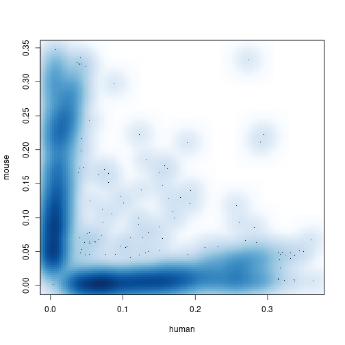

# Tim's stab at classification and plotting 

Recall that we are seeking to identify the influence of two factors on our
ability to classify cells: the experimental vial and the library prep protocol. 
Since we are going to give in to dichotomania and label cells as "classifiable" 
or "not classifiable" at a given set of thresholds, we've got a logistic 
regression on our hands (i.e., we will be modeling the logit-transformed
probability of classification, _p_, as the underlying response to conditions). 
Despite looking different from a linear model (which in the two-group case, 
you will recall, is tested for significance using a marginal t-test), we can 
rely upon a generalized version of residual variance called [deviance]("https://en.wikipedia.org/wiki/Deviance_(statistics) "Wikipedia page for deviance") to 
let us answer ANOVA-style questions: "how much variability is explained by a
particular factor in the model?" First we need to set up our response variable, 
i.e., the ability to classify a cell confidently.  For that, we need cutoffs. 

 

The barcode, UMI, set or [BUS format](https://academic.oup.com/bioinformatics/article/35/21/4472/5487510) neatly encapsulates the process of transforming reads
resulting from a single-cell RNAseq experiment into counts of molecular barcodes
describing a cell, a molecule, and the likely genomic origin of that molecule.
It's one of the most compact representations possible for raw scRNAseq outputs, 
and the figure shows how it facilitates direct comparisons. The Broad used their
`scumi` tool instead, but the basic notion ("make everything comparable") and 
the resulting sparse matrix of counts is similar in spirit. 


With the release of Bioconductor 3.14, the project includes a tidy single cell 
experiment (data structure) package, which is great since all other single cell 
data structures kind of suck. (No, seriously, you'll find out why eventually.) 
The package is, not coincidentally, called [tidySingleCellExperiment](http://www.bioconductor.org/packages/release/bioc/vignettes/tidySingleCellExperiment/inst/doc/introduction.html):

<details>
  <summary>Click for details</summary>

```r

if (!require("SingleCellExperiment")) {
  BiocManager::install("SingleCellExperiment")
  library(SingleCellExperiment)
}
if (!require("tidySingleCellExperiment")) {
  BiocManager::install("tidySingleCellExperiment")
  library(tidySingleCellExperiment)
}

```
</details>

# Sort-of-bonus: resampling

Above, I stated that maybe we don't need thousands of cells per method. 
You could always adjust the `ideal` argument to the function below to resample:
<details>
  <summary>Click for sample_umis() function code</summary>

```r

# adapted from a SingleCellExperiment-centric method for CITEseq
sample_umis <- function(umis, meta, block, ideal=300) {

  stopifnot(nrow(meta) == ncol(umis))
  stopifnot(length(block) == nrow(meta))

  pops <- sort(table(block))
  samplesets <- split(seq_len(nrow(meta)), block)

  keep <- integer()
  for (set in names(samplesets)) {
    sset <- samplesets[[set]]
    cells <- length(sset)
    if (cells <= ideal) {
      pct <- 100
      keep <- c(keep, sset)
      message("Kept ", cells, " cells (", pct, "%) of type ", set, ".")
    } else {
      kept <- sample(sset, size=ideal)
      pct <- round((ideal / cells) * 100)
      keep <- c(keep, kept)
      message("Kept ", ideal, " cells (", pct, "%) of type ", set, ".")
    }
  }

  pct <- round((length(keep) / ncol(umis)) * 100, 1)
  message("Kept ", length(keep), " (", pct, "%) of ", ncol(umis),
          " cells in ", length(samplesets), " blocks.")
  umis[, keep]

}
```
</details> 

Load the data:


```r

library(SingleCellExperiment) 
library(tidySingleCellExperiment)

if (!exists("tidybarnyard"))  
tidybarnyard <- tidy(readRDS(url("https://ttriche.github.io/RDS/barnyard.rds")))
rowGenome <- rowData(tidybarnyard)$genome
```

Let's set up some thresholds for classifying cells as mouse or human. First, we
need to determine what fraction of transcripts from each genome each cell is 
expressing.  This is a job for a little function. 


```r

genomes <- c(human="hg19", mouse="mm10") 
fracExpressed <- function(g, object) {
  subs <- subset(object, rowData(object)$genome == g)
  colSums(counts(subs) > 0) / nrow(subs)
}

fracByCell <- do.call(cbind, 
                      lapply(genomes, fracExpressed, object=tidybarnyard))
smoothScatter(fracByCell) 
```



_Question: Can you do this again but for each method?_

_Question: Can you do this again but for each mixture?_
