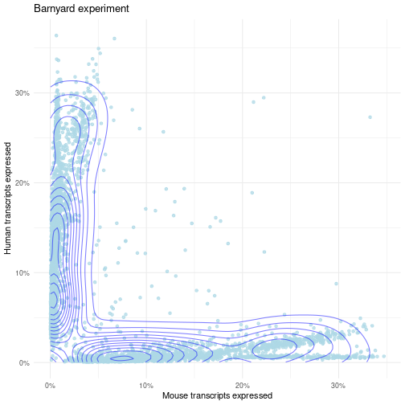
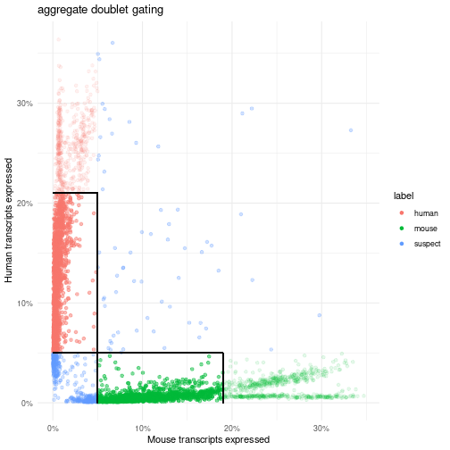
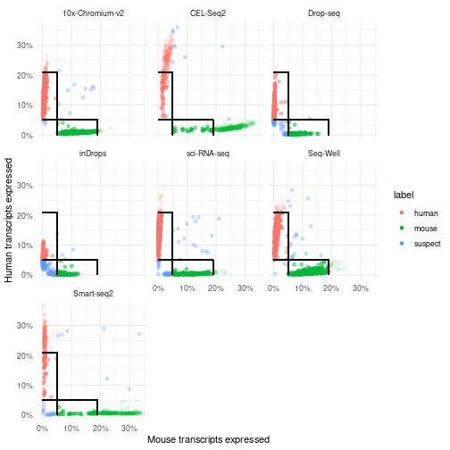
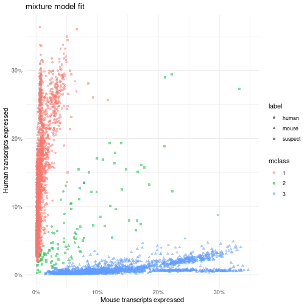

# Background

Recall that we are seeking to identify the influence of two factors on our
ability to classify cells: the experimental vial and the library prep protocol. 
Since we are going to give in to dichotomania and label cells as "classifiable" 
or "not classifiable" at a given set of thresholds, we've got a logistic 
regression on our hands (i.e., we will be modeling the logit-transformed
probability of classification, _p_, as the underlying response to conditions). 
Despite looking different from a linear model (which in the two-group case, 
you will recall, is tested for significance using a marginal t-test), we can 
rely upon a generalized version of residual variance called [deviance]("https://en.wikipedia.org/wiki/Deviance_(statistics) "Wikipedia page for deviance") to 
let us answer ANOVA-style questions: "how much variability is explained by a
particular factor in the model?" First we need to set up our response variable, 
i.e., the ability to classify a cell confidently.  For that, we need cutoffs. 

# tidySingleCellExperiment

With the release of Bioconductor 3.14, the project includes a tidy single cell 
experiment (data structure) package, which is great since all other single cell 
data structures kind of suck. (No, seriously, you'll find out why eventually.) 
The package is, not coincidentally, called [tidySingleCellExperiment](http://www.bioconductor.org/packages/release/bioc/vignettes/tidySingleCellExperiment/inst/doc/introduction.html):

<details>
  <summary>Click for details</summary>

```r

if (!require("SingleCellExperiment")) {
  BiocManager::install("SingleCellExperiment")
  library(SingleCellExperiment)
}
if (!require("tidySingleCellExperiment")) {
  BiocManager::install("tidySingleCellExperiment")
  library(tidySingleCellExperiment)
}

```
</details>

# Sort-of-bonus: resampling

Above, I stated that maybe we don't need thousands of cells per method. 
You could always adjust the `ideal` argument to the function below to resample:
<details>
  <summary>Click for sample_umis() function code</summary>

```r

# adapted from a SingleCellExperiment-centric method for CITEseq
sample_umis <- function(umis, meta, block, ideal=300) {

  # {{{
  stopifnot(nrow(meta) == ncol(umis))
  stopifnot(length(block) == nrow(meta))

  pops <- sort(table(block))
  samplesets <- split(seq_len(nrow(meta)), block)

  keep <- integer()
  for (set in names(samplesets)) {
    sset <- samplesets[[set]]
    cells <- length(sset)
    if (cells <= ideal) {
      pct <- 100
      keep <- c(keep, sset)
      message("Kept ", cells, " cells (", pct, "%) of type ", set, ".")
    } else {
      kept <- sample(sset, size=ideal)
      pct <- round((ideal / cells) * 100)
      keep <- c(keep, kept)
      message("Kept ", ideal, " cells (", pct, "%) of type ", set, ".")
    }
  }

  pct <- round((length(keep) / ncol(umis)) * 100, 1)
  message("Kept ", length(keep), " (", pct, "%) of ", ncol(umis),
          " cells in ", length(samplesets), " blocks.")
  umis[, keep]
  # }}}

}
```
</details> 

# Tim's stab at classification and plotting 

It will be difficult to evaluate our strategy if we don't first load the data:


```r

library(SingleCellExperiment) 
#> Loading required package: SummarizedExperiment
#> Loading required package: MatrixGenerics
#> Loading required package: matrixStats
#> 
#> Attaching package: 'matrixStats'
#> The following object is masked from 'package:dplyr':
#> 
#>     count
#> 
#> Attaching package: 'MatrixGenerics'
#> The following objects are masked from 'package:matrixStats':
#> 
#>     colAlls, colAnyNAs, colAnys, colAvgsPerRowSet, colCollapse,
#>     colCounts, colCummaxs, colCummins, colCumprods, colCumsums,
#>     colDiffs, colIQRDiffs, colIQRs, colLogSumExps, colMadDiffs,
#>     colMads, colMaxs, colMeans2, colMedians, colMins, colOrderStats,
#>     colProds, colQuantiles, colRanges, colRanks, colSdDiffs, colSds,
#>     colSums2, colTabulates, colVarDiffs, colVars, colWeightedMads,
#>     colWeightedMeans, colWeightedMedians, colWeightedSds,
#>     colWeightedVars, rowAlls, rowAnyNAs, rowAnys, rowAvgsPerColSet,
#>     rowCollapse, rowCounts, rowCummaxs, rowCummins, rowCumprods,
#>     rowCumsums, rowDiffs, rowIQRDiffs, rowIQRs, rowLogSumExps,
#>     rowMadDiffs, rowMads, rowMaxs, rowMeans2, rowMedians, rowMins,
#>     rowOrderStats, rowProds, rowQuantiles, rowRanges, rowRanks,
#>     rowSdDiffs, rowSds, rowSums2, rowTabulates, rowVarDiffs, rowVars,
#>     rowWeightedMads, rowWeightedMeans, rowWeightedMedians,
#>     rowWeightedSds, rowWeightedVars
#> Loading required package: GenomicRanges
#> Loading required package: stats4
#> Loading required package: BiocGenerics
#> 
#> Attaching package: 'BiocGenerics'
#> The following objects are masked from 'package:stats':
#> 
#>     IQR, mad, sd, var, xtabs
#> The following objects are masked from 'package:dplyr':
#> 
#>     combine, intersect, setdiff, union
#> The following objects are masked from 'package:base':
#> 
#>     Filter, Find, Map, Position, Reduce, anyDuplicated, append,
#>     as.data.frame, basename, cbind, colnames, dirname, do.call,
#>     duplicated, eval, evalq, get, grep, grepl, intersect, is.unsorted,
#>     lapply, mapply, match, mget, order, paste, pmax, pmax.int, pmin,
#>     pmin.int, rank, rbind, rownames, sapply, setdiff, sort, table,
#>     tapply, union, unique, unsplit, which.max, which.min
#> Loading required package: S4Vectors
#> 
#> Attaching package: 'S4Vectors'
#> The following object is masked from 'package:tidyr':
#> 
#>     expand
#> The following objects are masked from 'package:dplyr':
#> 
#>     first, rename
#> The following objects are masked from 'package:base':
#> 
#>     I, expand.grid, unname
#> Loading required package: IRanges
#> 
#> Attaching package: 'IRanges'
#> The following object is masked from 'package:purrr':
#> 
#>     reduce
#> The following objects are masked from 'package:dplyr':
#> 
#>     collapse, desc, slice
#> Loading required package: GenomeInfoDb
#> Loading required package: Biobase
#> Welcome to Bioconductor
#> 
#>     Vignettes contain introductory material; view with
#>     'browseVignettes()'. To cite Bioconductor, see
#>     'citation("Biobase")', and for packages 'citation("pkgname")'.
#> 
#> Attaching package: 'Biobase'
#> The following object is masked from 'package:MatrixGenerics':
#> 
#>     rowMedians
#> The following objects are masked from 'package:matrixStats':
#> 
#>     anyMissing, rowMedians
library(tidySingleCellExperiment)

# should package this... 
if (!exists("tidybarnyard"))  
tidybarnyard <- tidy(readRDS(url("https://ttriche.github.io/RDS/barnyard.rds")))
#> Warning: `tidy()` was deprecated in tidySingleCellExperiment 1.1.1.
#> tidySingleCellExperiment says: tidy() is not needed anymore.
#> This warning is displayed once every 8 hours.
#> Call `lifecycle::last_lifecycle_warnings()` to see where this warning was generated.
```
It will be useful to know that, when you use the `$` operator on a typical 
Bioconductor object (such as a _tidySingleCellExperiment_ like ours), it assumes
you want to see the column data (`colData`) with that name (see below). For
example, when we built up the `tidybarnyard` object from the cell and gene 
tables (by splitting and mutating them), we fed them to the SingleCellExperiment
constructor function and it bolted them onto the side of the object. It turns
out _[SingleCellExperiment](https://www.nature.com/articles/s41592-019-0654-x)_ 
is just a modified version of _[SummarizedExperiment](https://www.nature.com/articles/nmeth.3252)_:

 

The figure from the original paper is better/easier to understand, although you
can certainly read about the new one. TidySingleCellExperiment wraps the "newer"
_[SingleCellExperiment](https://www.nature.com/articles/s41592-019-0654-x)_
so that it plays somewhat more nicely with the tidyverse we've all been using.
There are many other approaches to analyzing single-cell data, and you may well
bump into several of them, but this one happens to be very efficient. Plus, 
keeping sample- or cell-specific details lined up with columns, and gene- or 
feature-specific details lined up with rows, tends to stay in style. The only
annoying feature (ha!) with this setup is that you need to explicitly tell R 
when you want data about the rows themselves (i.e., the rowData). 

The _[tidySingleCellExperiment](http://www.bioconductor.org/packages/release/bioc/vignettes/tidySingleCellExperiment/inst/doc/introduction.html)_ package gives
us some tools to stay in the Tidyverse as much as possible while working with
single-cell data. (It turns out that the underlying data makes this somewhat 
less trivial than you might expect. Fortunately, you don't have to care.) 

Concretely, let's see how these moving parts fit together. The `dim` function
provides dimensions for a rectangular object, rows x columns, which makes it 
a little easier to keep track of what's going on when we subset either one. 


```r

# as what is our object masquerading?
show(tidybarnyard[,0]) # "just show me information about it, with 0 cells"
#> # A SingleCellExperiment-tibble abstraction: 0 × 5
#> # Features=62046 | Assays=counts
#> # … with 5 variables: cell <chr>, name <chr>, experiment <chr>, method <chr>,
#> #   cell <chr>

# how many rows (genes) and columns (cells) are there in our tidy barnyard?
dim(tidybarnyard)
#> [1] 62046  4199

# is this equivalent to what we get from nrow() and ncol()? 
identical(dim(tidybarnyard), 
          c(nrow(tidybarnyard), ncol(tidybarnyard)))
#> [1] TRUE

# the assay(s) should also have this many rows and columns. Do they?
identical(dim(tidybarnyard), dim(assay(tidybarnyard)))
#> [1] TRUE

# there is a shortcut for the `counts` assay, since it's so common:
counts(tidybarnyard)[1:3, 1:3]
#> 3 x 3 sparse Matrix of class "dgCMatrix"
#>                                  Mixture1.10x-Chromium-v2.GGGCATCGTCACACGC
#> hg19_ENSG00000000003_hg19_TSPAN6                                         1
#> hg19_ENSG00000000005_hg19_TNMD                                           .
#> hg19_ENSG00000000419_hg19_DPM1                                           2
#>                                  Mixture1.10x-Chromium-v2.CACATAGAGATACACA
#> hg19_ENSG00000000003_hg19_TSPAN6                                         .
#> hg19_ENSG00000000005_hg19_TNMD                                           .
#> hg19_ENSG00000000419_hg19_DPM1                                           .
#>                                  Mixture1.10x-Chromium-v2.CACTCCATCCTCCTAG
#> hg19_ENSG00000000003_hg19_TSPAN6                                         .
#> hg19_ENSG00000000005_hg19_TNMD                                           .
#> hg19_ENSG00000000419_hg19_DPM1                                           .

# does each row (gene) in the object have a corresponding rowData() row?
identical(rownames(tidybarnyard), rownames(rowData(tidybarnyard)))
#> [1] TRUE

# does each column (cell) in the object have a corresponding colData() row?
identical(colnames(tidybarnyard), rownames(colData(tidybarnyard)))
#> [1] TRUE

# is there a rowData row and a colData row that corresponds to each UMI count?
identical(dim(counts(tidybarnyard)), 
          c(nrow(rowData(tidybarnyard)), nrow(colData(tidybarnyard)))) 
#> [1] TRUE

# does that mean we can ask for a random cell with certain attributes?
as_tibble(tidybarnyard) %>%           # "turn the colData into a tibble"
  filter(method == "inDrops") %>%     # "choose rows where method == inDrops"
  slice_sample %>%                    # "randomly slice out one row"
  pull("cell") -> aCell               # "pull the column cell, assign to aCell"
#> Error: Can't transform a data frame with duplicate names.

# your cell:
show(aCell) 
#> Error in h(simpleError(msg, call)): error in evaluating the argument 'object' in selecting a method for function 'show': object 'aCell' not found

# does that mean we can ask for a random gene with certain attributes?
as_tibble(rowData(tidybarnyard)) %>%  # "turn the rowData into a tibble"
  filter(genome == "mm10") %>%        # "choose rows where genome == mm10"
  slice_sample %>%                    # "randomly slice out one row"
  pull("name") -> aGene               # "pull the column name, assign to aGene" 

# your gene:
show(aGene) 
#> [1] "mm10_ENSMUSG00000098847_mm10_Gm27235"

# how many copies of this random gene were found in this random cell? 
counts(tidybarnyard)[aGene, aCell] 
#> Error in h(simpleError(msg, call)): error in evaluating the argument 'j' in selecting a method for function '[': object 'aCell' not found

# note that the odds are good that you'll get a 0 for this random combination:
library(Matrix)                                 # for the `nnzero` function 
sparsity <- 1 - (nnzero(counts(tidybarnyard)) / # number of nonzero counts
                 prod(dim(tidybarnyard)))       # number of rows * columns 

# specifically, the chance of getting a zero is about 92.3%: 
message(round(sparsity * 100, 1), "%")
#> 92.3%

# This is fairly typical for a single-cell experiment, perhaps a bit low even.
# You could also take 10000 or so random samples to estimate the sparsity.
# For example, you could grab 100 genes from 100 cells at a time: 
as_tibble(tidybarnyard) %>%       # turn tidybarnyard's colData into a tibble
  slice_sample(n=100) %>%         # slice out 100 random rows, and then... 
  pull("cell") -> aHundredCells   # assign the "cell" column to "aHundredCells"
#> Error: Can't transform a data frame with duplicate names.

as_tibble(rowData(tidybarnyard)) %>% # turn tidybarnyard's rowData into a tibble
  slice_sample(n=100) %>%            # slice out 100 random rows, and then 
  pull("name") -> aHundredGenes      # assign "name" column to "aHundredGenes"

samples <- (length(aHundredCells) * length(aHundredGenes))
#> Error in eval(expr, envir, enclos): object 'aHundredCells' not found
nonzero <- nnzero(counts(tidybarnyard)[aHundredGenes, aHundredCells])
#> Error in h(simpleError(msg, call)): error in evaluating the argument 'x' in selecting a method for function 'nnzero': error in evaluating the argument 'j' in selecting a method for function '[': object 'aHundredCells' not found
sparsity_hat <- (samples - nonzero) / samples 
#> Error in eval(expr, envir, enclos): object 'nonzero' not found
sparsity_hat # estimated sparsity
#> Error in eval(expr, envir, enclos): object 'sparsity_hat' not found

# In fact, we can use this scheme to look at sampling error:
sample_sparsity <- function(object, cells=100, genes=100) { 

  samples <- cells * genes 
  columns <- pull(slice_sample(as_tibble(object), n=cells), "cell")
  rows <- pull(slice_sample(as_tibble(rowData(object)), n=genes), "name")
  nonzero <- nnzero(counts(object)[rows, columns])
  sparsity <- (samples - nonzero) / samples
  return(sparsity) 

}

# the `replicate` function allows us to apply this many times over:
estimates <- replicate(n=100, sample_sparsity(tidybarnyard)) # "do it 100 times"
#> Error: Can't transform a data frame with duplicate names.

# plot estimates: 
library(ggplot2)
ggplot(tibble(estimate=estimates), aes(estimate)) + 
  geom_histogram() + 
  geom_vline(xintercept=sparsity, color="red", lwd=3) +
  theme_minimal() + 
  ggtitle("Sparsity of UMI matrix (true value in red)")
#> Error in eval_tidy(xs[[j]], mask): object 'estimates' not found

# the Central Limit Theorem lives to fight another day,
# and we have a decent idea of how to navigate our data.
```

Often, when someone cracks open a single cell dataset, the first thing they do
is to cluster the cells (based on whatever approach is fashionable). We don't 
need to do that here. In fact, if you do plot the usual UMAP'ed clusters, 
you'll mostly just see a batch effect. This takes a while to compute, so I 
recommend you not bother with the next chunk. 


```r

library(scater)
# it is standard to log-normalize counts
# (although it's not actually a great idea)
tidybarnyard <- logNormCounts(tidybarnyard)

# compute UMAP embedding on the most variable genes
tidybarnyard %>% runUMAP(ncomponents=3) -> tidyUMAP

# plot using plotly, color by method
tidyUMAP %>%
  plot_ly(
    x =~ `UMAP1`,
    y =~ `UMAP2`,
    z =~ `UMAP3`,
    color =~ method
  )

```

For this project, we know that the reads from each library (cell) were 
competitively aligned against the mouse and human genomes. So all we really
need to do is to decide what we'll call a "mouse cell", what we'll call a 
"human cell", and which we aren't confident calling either (unclassifiable).

Originally, I wrote a little function to calculate what fraction of transcripts
from a genome were present in a given cell, and then made a matrix out of the 
results. But since we already have a place to store the per-cell results,
why not just use that instead? 


```r

# identify the mouse genes:
as_tibble(rowData(tidybarnyard)) %>%  # make a tibble from the rowData
  filter(genome == "mm10") %>%        # select just the mouse mm10 genes 
  pull("name") -> mouseGenes          # assign their name column to mouseGenes

# for technical reasons, it's faster to tally expressed genes this way:
tidybarnyard$fracmouse <- 
  (colSums(counts(tidybarnyard)[mouseGenes, ] > 0)) / length(mouseGenes)

# do the same thing but with human genes:
as_tibble(rowData(tidybarnyard)) %>%  # make a tibble from the rowData
  filter(genome == "hg19") %>%        # select just the human hg19 genes 
  pull("name") -> humanGenes          # assign their name column to humanGenes

# same remarks as previously
tidybarnyard$frachuman <- 
  (colSums(counts(tidybarnyard)[humanGenes, ] > 0)) / length(humanGenes)

# why normalize by gene count?
as_tibble(rowData(tidybarnyard)) %>% select("genome") %>% table
#> .
#>  hg19  mm10 
#> 33354 28692


# let's use ggplot to make sense of the results:
barnyardtibble <- as_tibble(tidybarnyard)

p <- ggplot(barnyardtibble, aes(x=fracmouse, y=frachuman)) + 
  xlab("Mouse transcripts expressed") +
  scale_x_continuous(labels = scales::percent) +
  ylab("Human transcripts expressed") +
  scale_y_continuous(labels = scales::percent) +
  geom_point(alpha=0.75, color="lightblue") +
  geom_density2d(alpha=0.5, color="blue") + 
  theme_minimal() 

# first pass at a plot: 
p + ggtitle("Barnyard experiment") 
#> Error: `data` must be uniquely named but has duplicate columns
```



# Gating

Suppose we want to implement some logic for "gating" cells.  For example, 
we might say "if a cell has greater than 0.05 human transcriptomes expressed, 
but less than 0.05 mouse transcriptomes, we'll call it human; if vice versa, 
we'll call it a mouse cell; and if it has more than 0.05 of each, it's suspect".

Needless to say this can stand a bit of exploration. Originally, I thought I'd 
need to resort to writing functions for this purpose. Now I think it's actually
better to do it in a 'tidy' fashion.  Let's use `mutate` for this purpose. 


```r

# arbitrarily:
minhuman <- 0.05
minmouse <- 0.05 
# Let's label any cell that is more than 5% (0.05) of BOTH genomes as suspect.

# add a label:
barnyardtibble %>% 
  mutate(label = 
         case_when(frachuman > minhuman & fracmouse < minmouse ~ "human", 
                   fracmouse > minmouse & frachuman < minhuman ~ "mouse",
                   TRUE ~ "suspect")) -> barnyardtibble
#> Error: Can't transform a data frame with duplicate names.

# add our initial stab at labeling:
p <- ggplot(barnyardtibble, aes(x=fracmouse, y=frachuman, color=label)) + 
  xlab("Mouse transcripts expressed") +
  scale_x_continuous(labels = scales::percent) +
  ylab("Human transcripts expressed") +
  scale_y_continuous(labels = scales::percent) +
  geom_point(alpha=0.75) + 
  theme_minimal() 

# plot it with some gates and density lines:
p + geom_density2d(alpha=0.5, color="blue") + 
  geom_vline(xintercept=minmouse, color="red") + 
  geom_hline(yintercept=minhuman, color="red") + 
  ggtitle("First stab at gating")
#> Error: `data` must be uniquely named but has duplicate columns
```


This is looking a little better, but the density plots suggest there's a "hump"
at about 19% mouse or about 21% human above which the cells look like doublets.


```r

# arbitrarily:
maxhuman <- 0.21
maxmouse <- 0.19 

# make it obvious which cells are going to be gated out if we do this: 
barnyardtibble %>% 
  mutate(doublet = frachuman > maxhuman | fracmouse > maxmouse) %>%
  mutate(shading = case_when(label == "suspect" ~ 0.3,
                             doublet == TRUE ~ 0.1, 
                             TRUE ~ 0.5)) -> barnyardtibble
#> Error: Can't transform a data frame with duplicate names.

# start like the previous plot, but add low and high "gates" for each species:
p <- ggplot(barnyardtibble, 
            aes(x=fracmouse, y=frachuman, color=label, alpha=I(shading))) + 
  xlab("Mouse transcripts expressed") +
  scale_x_continuous(labels = scales::percent) +
  ylab("Human transcripts expressed") +
  scale_y_continuous(labels = scales::percent) +
  geom_point() + 
  geom_segment(y=0, yend=minhuman, x=minmouse, xend=minmouse, color="black") + 
  geom_segment(y=0, yend=minhuman, x=maxmouse, xend=maxmouse, color="black") + 
  geom_segment(y=minhuman, yend=minhuman, x=minmouse, xend=maxmouse, 
               color="black") + 
  geom_segment(y=minhuman, yend=minhuman, x=0, xend=minmouse, color="black") + 
  geom_segment(y=maxhuman, yend=maxhuman, x=0, xend=minmouse, color="black") + 
  geom_segment(y=minhuman, yend=maxhuman, x=minmouse, xend=minmouse, 
               color="black") + 
  theme_minimal() 
 
# plot it
p + ggtitle("aggregate doublet gating")
#> Error: `data` must be uniquely named but has duplicate columns
```



Before we gate those out, let's see if this is related to library prep method:


```r

# reuse the plot again:
p + facet_wrap(~ method)
#> Error: `data` must be uniquely named but has duplicate columns
```



On second thought, let's gate on the minimums instead of throwing away cells.
We know this isn't a perfect approach to choosing a library prep method, but 
it's surprisingly less bad than many approaches ("what's fashionable?", etc). 


```r

# we need a 0/1 outcome to perform logistic regression: 
barnyardtibble %>% mutate(classifiable = label != "suspect") -> barnyardtibble
#> Error: Can't transform a data frame with duplicate names.

# logistic regression in R uses the glm() or general linear model function,
# with a binomial (0/1) link, and the result can be compared like any lm(): 
fit0 <- glm(classifiable ~ 1, data=barnyardtibble, family=binomial) # null model
#> Error in eval(predvars, data, env): object 'classifiable' not found

# add `method` to the predictors 
fit1 <- update(fit0, classifiable ~ method)
#> Error in h(simpleError(msg, call)): error in evaluating the argument 'object' in selecting a method for function 'update': object 'fit0' not found

# add `method` and `experiment` to the predictors 
fit2 <- update(fit1, classifiable ~ method + experiment) 
#> Error in h(simpleError(msg, call)): error in evaluating the argument 'object' in selecting a method for function 'update': object 'fit1' not found

# add `method` and `experiment` to the predictors, no intercept
fit3 <- update(fit2, classifiable ~ method + experiment + 0) 
#> Error in h(simpleError(msg, call)): error in evaluating the argument 'object' in selecting a method for function 'update': object 'fit2' not found

# add `method` as the sole predictor, no intercept
fit4 <- update(fit0, classifiable ~ method + 0) 
#> Error in h(simpleError(msg, call)): error in evaluating the argument 'object' in selecting a method for function 'update': object 'fit0' not found
```

Remember that logistic regression transforms the input probabilities, and that 
means the coefficient estimates transform too.  (Specifically, via `logit()`.) 
In order to estimate the impact of a predictor back in "normal" space, you need
to expit (i.e., inverse logit) the values. Happily, the `coefplot` package will
do this for you, and the results can be interpreted as "what are the odds that 
I will be able to classify a given cell with this method". 


```r

# it's better to use confidence intervals than p-values for fitting purposes,
# and it's even better yet to plot them all:
library(coefplot)

# classifiable ~ method
coefplot(fit1, trans=invlogit) + theme_minimal() 
#> Error in coefplot(fit1, trans = invlogit): object 'fit1' not found

# classifiable ~ method + experiment
coefplot(fit2, trans=invlogit) + theme_minimal() 
#> Error in coefplot(fit2, trans = invlogit): object 'fit2' not found

# classifiable ~ method + experiment, no intercept
coefplot(fit3, trans=invlogit) + theme_minimal() 
#> Error in coefplot(fit3, trans = invlogit): object 'fit3' not found

# classifiable ~ method, no intercept
coefplot(fit4, trans=invlogit) + theme_minimal() 
#> Error in coefplot(fit4, trans = invlogit): object 'fit4' not found
```

Any thoughts on which library prep you'd use if cost is no object? 

# Mixture models as an alternative to manual gating

Incidentally, we could also use a mixture model to classify all the points, and 
in fact that is how I'd usually do it. One of my lab members has been working on
automatic gating of actual flow cytometry data this way, in fact, and it works
*great*.  So without further ado... 


```r

# one of the greatest software packages ever written, 
# fits a Gaussian mixture model with arbitrary covariance structure and uses 
# a Bayesian penalization scheme to choose how many components exist in the mix
library(mclust)
#>     __  ___________    __  _____________
#>    /  |/  / ____/ /   / / / / ___/_  __/
#>   / /|_/ / /   / /   / / / /\__ \ / /   
#>  / /  / / /___/ /___/ /_/ /___/ // /    
#> /_/  /_/\____/_____/\____//____//_/    version 5.4.8
#> Type 'citation("mclust")' for citing this R package in publications.

# since these are proportional values, it makes sense to transform them: 
mfit <- Mclust(logit(barnyardtibble[, c("fracmouse","frachuman")]), G=1:3)
#> fitting ...
#> 
  |                                                                            
  |                                                                      |   0%
  |                                                                            
  |==                                                                    |   2%
  |                                                                            
  |===                                                                   |   5%
  |                                                                            
  |=====                                                                 |   7%
  |                                                                            
  |=======                                                               |   9%
  |                                                                            
  |========                                                              |  12%
  |                                                                            
  |==========                                                            |  14%
  |                                                                            
  |===========                                                           |  16%
  |                                                                            
  |=============                                                         |  19%
  |                                                                            
  |===============                                                       |  21%
  |                                                                            
  |================                                                      |  23%
  |                                                                            
  |==================                                                    |  26%
  |                                                                            
  |====================                                                  |  28%
  |                                                                            
  |=====================                                                 |  30%
  |                                                                            
  |=======================                                               |  33%
  |                                                                            
  |========================                                              |  35%
  |                                                                            
  |==========================                                            |  37%
  |                                                                            
  |============================                                          |  40%
  |                                                                            
  |=============================                                         |  42%
  |                                                                            
  |===============================                                       |  44%
  |                                                                            
  |=================================                                     |  47%
  |                                                                            
  |==================================                                    |  49%
  |                                                                            
  |====================================                                  |  51%
  |                                                                            
  |=====================================                                 |  53%
  |                                                                            
  |=======================================                               |  56%
  |                                                                            
  |=========================================                             |  58%
  |                                                                            
  |==========================================                            |  60%
  |                                                                            
  |============================================                          |  63%
  |                                                                            
  |==============================================                        |  65%
  |                                                                            
  |===============================================                       |  67%
  |                                                                            
  |=================================================                     |  70%
  |                                                                            
  |==================================================                    |  72%
  |                                                                            
  |====================================================                  |  74%
  |                                                                            
  |======================================================                |  77%
  |                                                                            
  |=======================================================               |  79%
  |                                                                            
  |=========================================================             |  81%
  |                                                                            
  |===========================================================           |  84%
  |                                                                            
  |============================================================          |  86%
  |                                                                            
  |==============================================================        |  88%
  |                                                                            
  |===============================================================       |  91%
  |                                                                            
  |=================================================================     |  93%
  |                                                                            
  |===================================================================   |  95%
  |                                                                            
  |====================================================================  |  98%
  |                                                                            
  |======================================================================| 100%
# here I have restricted Mclust to fitting, at most, 3 components (G=1:3). 
# this speeds up the process and avoids some difficult questions later on ;-)

# create a new column of the barnyard tibble with the results: 
table(mfit$classification) # it turns out that we end up with less human cells
#> 
#>    1    2    3 
#> 2116 1941  142
barnyardtibble$mclass <- ifelse(mfit$classification == 2, "suspect", 
                                ifelse(mfit$classification == 1, "human", 
                                       "mouse")) # not sure how do this tidily.

# add mixture assignments:
p <- ggplot(barnyardtibble, 
            aes(x=fracmouse, y=frachuman, color=mclass, shape=label)) +
  xlab("Mouse transcripts expressed") +
  scale_x_continuous(labels = scales::percent) +
  ylab("Human transcripts expressed") +
  scale_y_continuous(labels = scales::percent) +
  geom_point(alpha=0.5) + 
  theme_minimal() 
 
# plot it
p + ggtitle("mixture model fit")
#> Error: `data` must be uniquely named but has duplicate columns
```



Suppose we re-run the regressions using the mixture model fits. What happens?


```r

barnyardtibble %>% mutate(mclassifiable = mclass != "suspect") -> barnyardtibble
#> Error: Can't transform a data frame with duplicate names.

# null model 
fitm0 <- glm(mclassifiable ~ 0, data=barnyardtibble, family=binomial) # random
#> Error in eval(predvars, data, env): object 'mclassifiable' not found

# regress `mclassifiable` on method, no intercept:
fitm1 <- update(fitm0, mclassifiable ~ method + 0) 
#> Error in h(simpleError(msg, call)): error in evaluating the argument 'object' in selecting a method for function 'update': object 'fitm0' not found
coefplot(fitm1, trans=invlogit) + theme_minimal() 
#> Error in coefplot(fitm1, trans = invlogit): object 'fitm1' not found

# regress `mclassifiable` on method and experiment, no intercept:
fitm2 <- update(fitm0, mclassifiable ~ method + experiment + 0) 
#> Error in h(simpleError(msg, call)): error in evaluating the argument 'object' in selecting a method for function 'update': object 'fitm0' not found
coefplot(fitm2, trans=invlogit) + theme_minimal() 
#> Error in coefplot(fitm2, trans = invlogit): object 'fitm2' not found

# regress `mclassifiable` on method interacting with experiment, no intercept:
fitm3 <- update(fitm0, mclassifiable ~ method * experiment + 0) 
#> Error in h(simpleError(msg, call)): error in evaluating the argument 'object' in selecting a method for function 'update': object 'fitm0' not found
coefplot(fitm3, trans=invlogit) + theme_minimal() 
#> Error in coefplot(fitm3, trans = invlogit): object 'fitm3' not found
```

Have your thoughts on which method to use changed?  Remember, each coefficient 
ends up being the odds that a cell can be classified, so you have to multiply 
through the values that are true for each cell. Given the confidence intervals
for experiment and the interaction terms, do they add much to the model? 

You *could* do this fit via ANOVA, but I claim it's a bit easier to interpret 
the odds (multiply by 100 to get percent chance of classification!) from LR.
One thing you might consider is to allow Mclust to use more possible values for
G (the number of Groups). Its default is "up to 10". If you plot the results,
do you still feel comfortable interpreting one of the groups as "suspect"? Is 
it still reasonable to use _glm_ (for logistic regression) in that case? 
